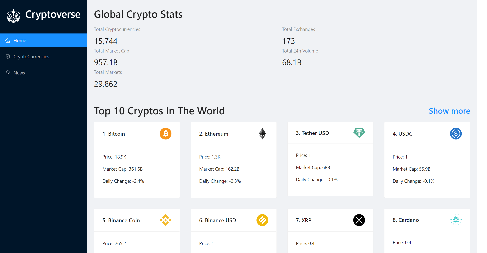
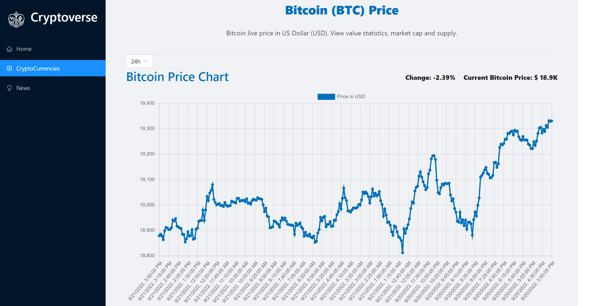
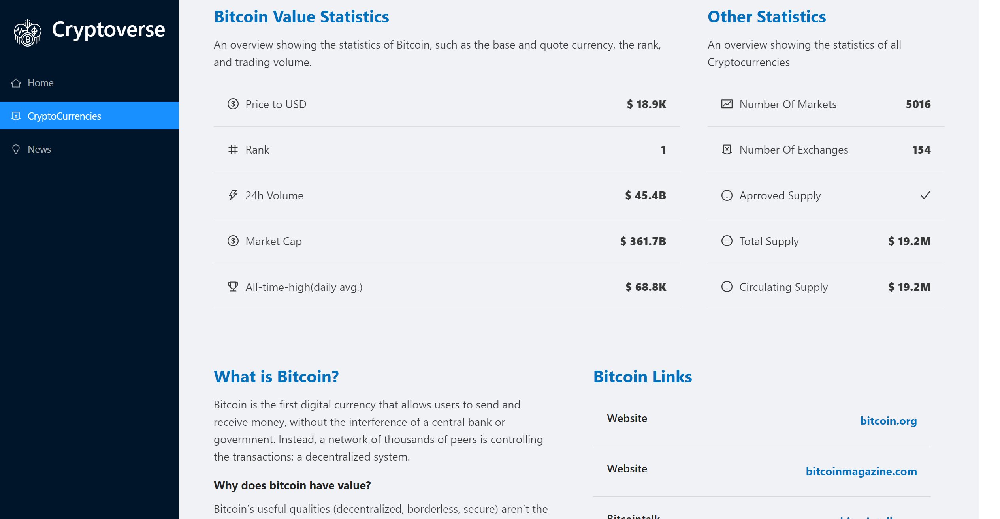

# Cryptoverse
### Cryptocurrency Real-time Information  web application

A React Frontend application provides the latest crypto prices and news from Rapid API. Taught by Javascript Mastery.
This project was bootstrapped with [Create React App](https://github.com/facebook/create-react-app).

## Preview

&nbsp;
&nbsp;

## Built with

- [React](https://reactjs.org/)
- [React-router](https://reactrouter.com/) v6
- [Redux Toolkit](https://redux-toolkit.js.org/) (include [RTK Query](https://redux-toolkit.js.org/rtk-query/overview))
- [Chart.js](https://www.chartjs.org/) from [react-chartjs-2](https://www.npmjs.com/package/react-chartjs-2)
- [Coinranking API](https://rapidapi.com/Coinranking/api/coinranking1?utm_source=youtube.com%2FJavaScriptMastery&utm_medium=DevRel&utm_campaign=DevRel)
- [Bing Search API](https://rapidapi.com/microsoft-azure-org-microsoft-cognitive-services/api/bing-news-search1?utm_source=youtube.com%2FJavaScriptMastery&utm_medium=DevRel&utm_campaign=DevRel)
- [Ant Design](https://ant.design/)
